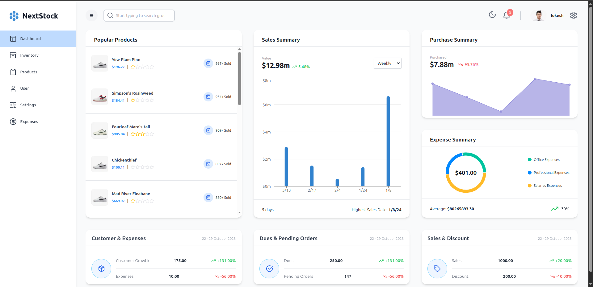
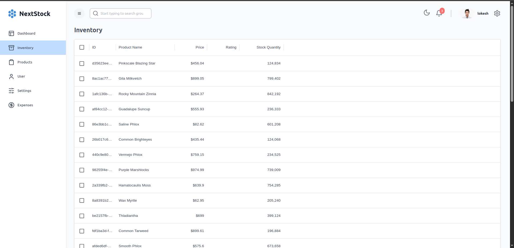
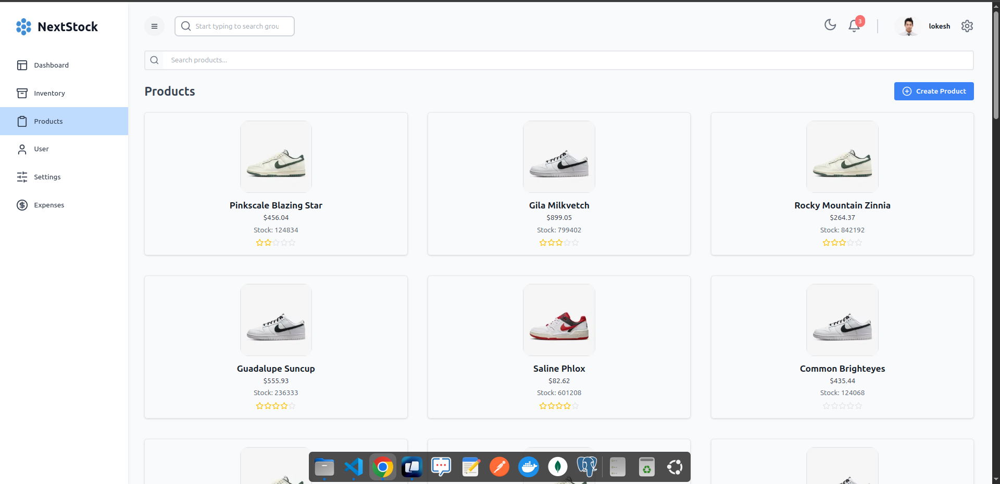
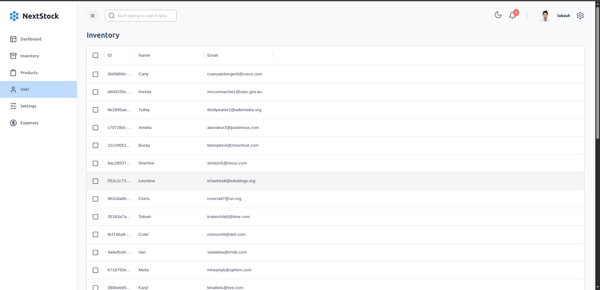
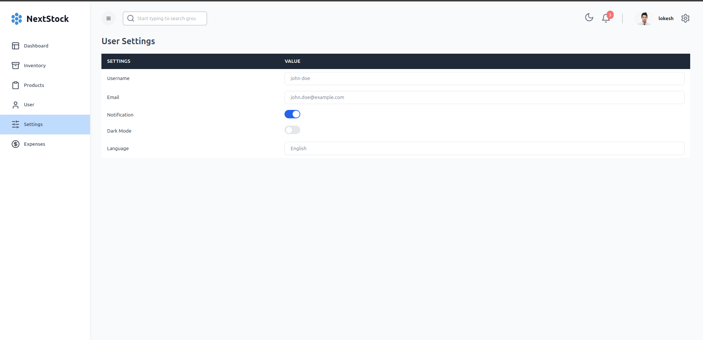
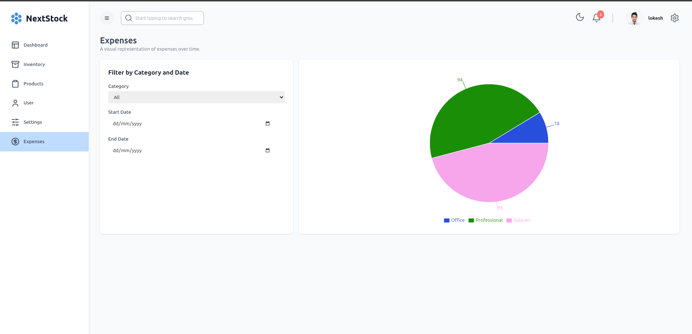
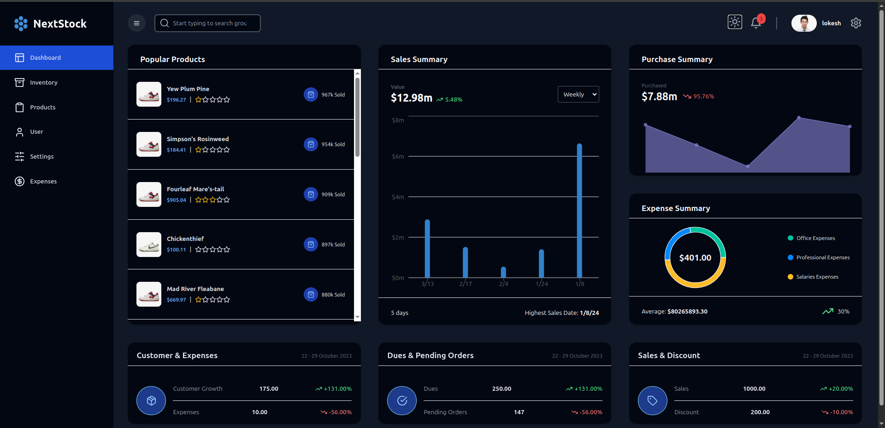

# 📦 NextStock

A modern, scalable **inventory management system** built with Next.js, PostgreSQL, and Prisma.
Easily track stock, manage products, and streamline your warehouse operations.

## [🔗 Live Demo](https://main.d1m6jqadu9oq7k.amplifyapp.com/)

## 🛠️ Tech Stack

| Frontend            | Backend      | Database     | Hosting       |
|---------------------|--------------|--------------|----------------|
| Next.js             | Node.js      | PostgreSQL   | AWS Amplify    |
| React.js            | Express.js   | Prisma ORM   | AWS RDS        |
| Axios               | Helmet       |              | AWS EC2        |
| Redux               |              |              | AWS VPC        |
| Redux Toolkit       |              |              |                |
| Recharts            |              |              |                |
| Material UI         |              |              |                |

## ✨ Features

### 📊 Dashboard Section

---

### 📦 Inventory Section

---

### 🛍️ Products Section

---

### 👤 Users Section

---

### ⚙️ Settings Section

---

### 💸 Expenses Section

---

### Dark Theme

---

**GitHub Profile**: [@Lokesh01](https://github.com/Lokesh01)
